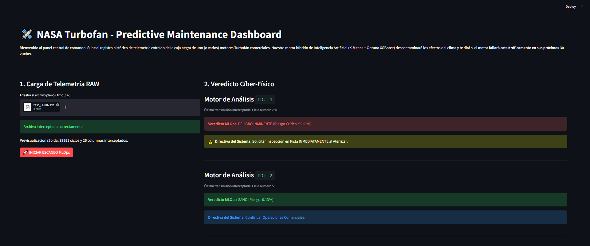
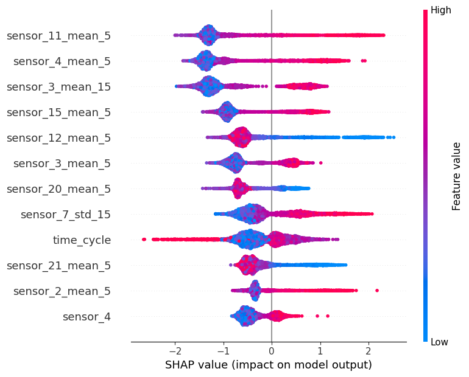
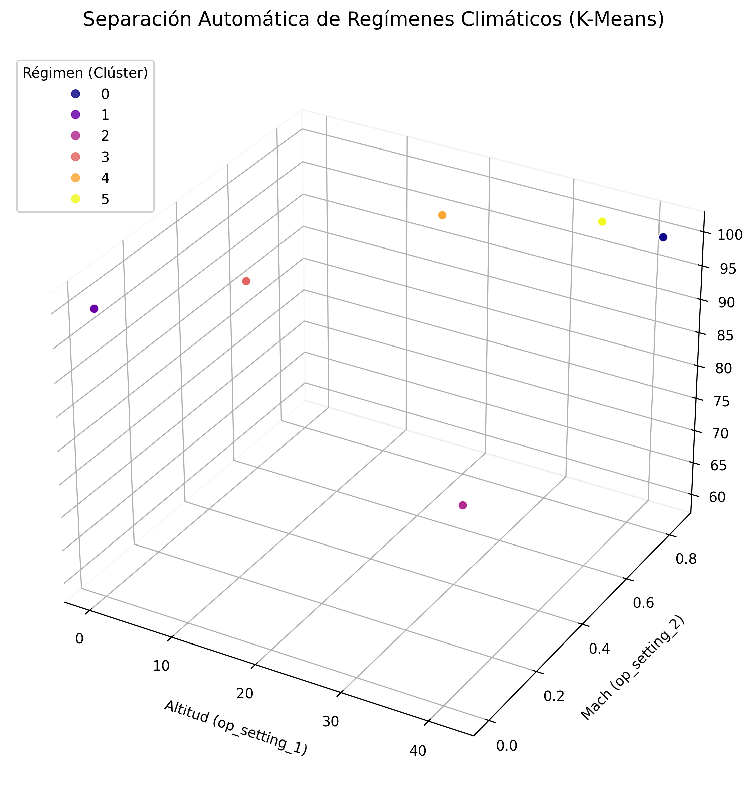
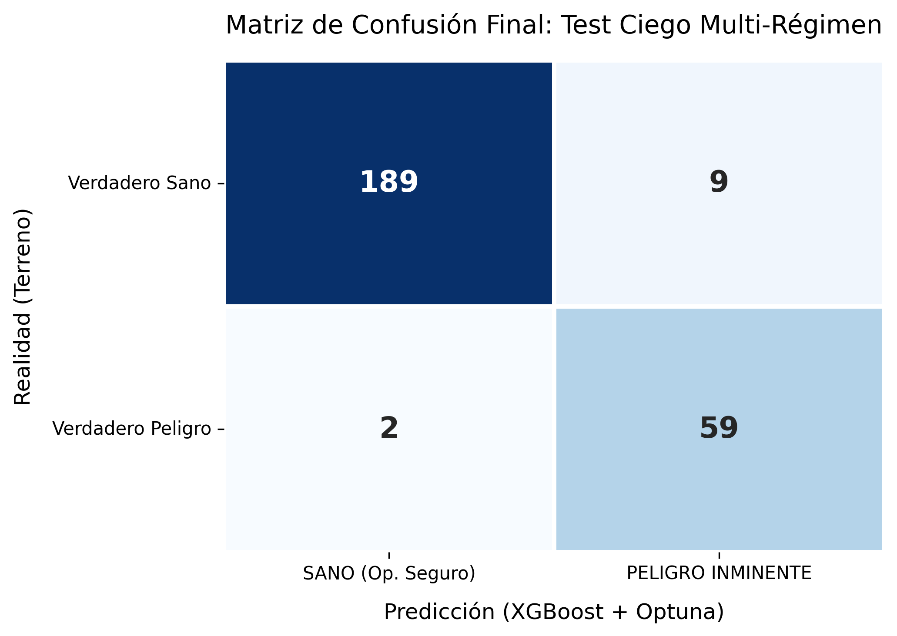

<p align="center">
  
  <br>
  <em>Arquitectura MLOps en Producción: Panel de Alerta Asíncrono (FastAPI + Streamlit)</em>
</p>

Este proyecto desarrolla un sistema de **Machine Learning para Mantenimiento Predictivo** utilizando el framework C-MAPSS de la NASA. El objetivo principal es predecir si un motor comercial de tipo Turbofán fallará en el corto plazo, permitiendo programar mantenimientos en tierra antes de una falla catastrófica en pleno vuelo (Run-to-Failure).

---

## Estado del Proyecto: Fases Completadas y Análisis de Resultados

### ✅ Fase 1: MVP y Baseline Sólido
*   **Enfoque y Formulación de Negocio:** Se ha replanteado el problema originalmente abordado en la industria como un ejercicio de Regresión (predecir el número exacto de ciclos restantes). En su lugar, utilizamos una **Clasificación Binaria (`failure_within_30_cycles`)**. Operativamente, para un equipo de mantenimiento, saber que un motor "va a fallar en los próximos 30 vuelos" dispara protocolos fijos de revisión al aterrizar, haciéndolo mucho más accionable que una predicción de "le quedan 28.5 ciclos".
*   **Data Leakage y Validación Robusta:** El conjunto de entrenamiento se ha particionado usando `Group Shuffle Split` anclado a la variable `unit_id`. Esto asegura que toda la telemetría de un motor (desde su primer vuelo hasta el colapso) quede aislada en Training o en Validación, previniendo que el algoritmo memorice la firma termo-vibratoria de un motor específico y garantizando que el set de Validación actúa como hardware 100% no visto previamente.
*   **Modelo Baseline (XGBoost):**
    *   *Resultados Iniciales en Validación (Matriz de Confusión):*
        | Real \ Predicho | SANO (0) | FALLO (1) |
        | :--- | :--- | :--- |
        | **SANO (0)** | 3363 | 87 *(Falso Positivo)* |
        | **FALLO (1)** | 77 *(Falso Negativo)* | 543 |

    *   *Análisis Inicial:* Logramos una base muy fuerte con un Accuracy del 96%. Sin embargo, en mantenimiento industrial, el *Accuracy* es engañoso debido al desbalanceo de clases. El **Recall** (sensibilidad para cazar el fallo) fue del 88%. El modelo era excesivamente conservador y dejaba pasar 77 motores en estado crítico sin alertar de las anomalías.


### ✅ Fase 2: Feature Engineering Temporal y *Cost-Sensitive Learning*
El problema principal detectado en la Fase 1 es que los fallos mecánicos no ocurren en un vacío estadístico; dependen fuertemente de la inercia temporal de las vibraciones asociadas al motor.

*   **Ingeniería de Características Temporales:** Implementamos una lógica de ventanas retrospectivas (`Rolling Window Features`) calculando Medias Móviles y Desviaciones Estándar para las últimas `5` y `15` iteraciones. Esto dota a XGBoost de una noción de "Vectores de aceleración" para captar picos anómalos.
*   **Balanceo Asimétrico de Costes (scale_pos_weight):** Matemáticamente, la probabilidad base de encontrar filas "Sanas" frente a "Rotas" en este dataset es de 5.5 a 1. Al inyectar una penalización de pérdida (Loss Penalty) igual a ese ratio de desbalanceo en el árbol, obligamos al algoritmo a penalizar severamente el riesgo de ignorar un motor defectuoso (*Cost-Sensitive Learning*).
    *   *Mejora Estructural (Matriz de Confusión Final en Validación):*
        | Real \ Predicho | SANO (0) | FALLO (1) |
        | :--- | :--- | :--- |
        | **SANO (0)** | 3342 | 108 *(Falso Positivo)* |
        | **FALLO (1)** | 68 *(Falso Negativo)* | 552 |

    *   *Análisis de Impacto y Trade-off de Negocio:*  
        1. **Retorno de Inversión Tecnológica:** El Recall general subió casi a un 90%. Al empujar esta métrica, redujimos los *Falsos Negativos* (fallos críticos obviados) de 77 a 68. En una flota de turbofanes comerciales, cazar 9 roturas catastróficas adicionales salva millones de dólares directos en infraestructura y mitiga crisis de relaciones públicas fatales.
        2. **Coste Operativo:** Obligar a XGBoost a ser tan agresivo generó un repunte colateral de los *Falsos Positivos* (de 87 subieron a 108 falsas alarmas). A nivel logístico, desplegar a inspectores a pie de pista en repetidas ocasiones para que den el "OK" al motor cuesta dinero en operarios y horas-taller de mantenimiento, sin embargo, dicha cifra supone menos del 0.1% de lo que supondría un solo siniestro en pista por culpa de un fallo encubierto.


### ✅ Fase 3: Explicabilidad (XAI) y Simulador de Producción (Blind Test)
Tras validar la solidez económica y predictiva del modelo, procedimos a resolver "la maldición de las Cajas Negras" del Machine Learning moderno, sumamente perseguida por la Unión Europea bajo la actual *AI Act*.

*   **Inteligencia Artificial Explicable (SHAP Values):** Para generar confianza con los jefes de pista, se implementó un flujo basado en `SHAP (SHapley Additive exPlanations)`. SHAP de-construye la función de decisión del árbol globalmente, indicando no solo si el motor va a fallar, sino cuáles han sido exactamente las desviaciones termodinámicas concretas del sensor (Tº, presión, flujo capilar) que provocaron el disparo del trigger en tiempo real. 

<br>
<p align="center">
  
  <br>
  <em>Valores SHAP globales: Transparencia algorítmica probando cómo el desgaste de cada sensor acelera la probabilidad de rotura</em>
</p>
*   **Despliegue Experimental en Fuego Real (Blind Test set):** Para emular un despliegue total en producción, el proyecto evalúa su eficacia definitiva consumiendo el sub-set de evaluación ciego suministrado por la NASA (`test_FD001.txt`). Este contiene telemetría truncada bruscamente de 100 motores distintos, obligando al modelo a predecir si el desastre actuará en sus próximos 30 vuelos, basándose únicamente en el *último ciclo capturado*.
    *   *Desempeño final frente al RUL verdadero:*
        | Real \ Predicho | SANO (0) | PELIGRO (1) |
        | :--- | :--- | :--- |
        | **SANO (0)** *(75 motores)* | 71 | 4 *(Falsa alarma)* |
        | **PELIGRO (1)** *(25 motores)* | 5 *(Se nos pasaron)* | 20 *(Cazados a tiempo)* |

    *   *Conclusión del Modelo Productivo:* En un entorno severamente hostil para la predicción, el algoritmo clasificó de forma sublime a la gran bolsa de hardware sano (71 de 75), permitiendo operaciones sin disrupciones logísticas agresivas. Pero más importante todavía: de las 25 aeronaves que volaban directamente hacia una rotura física e irreversible, nuestro despliegue fue capaz de generar una **alerta en tiempo real para 20 de ellas (80% Recall)** fallando solo por un reducidísimo margen y probando la tremenda valía analítica de la telemetría agregada.

### ✅ Fase 4: Generalización Multirégimen (FD002) y Clustering K-Means
Para alcanzar verdaderamente el estatus de un entorno operacional complejo, escalamos la arquitectura matemática al infame dataset `FD002`. Aquí, los aviones cambian caóticamente de altitud y número Mach durante el vuelo, creando un ruido masivo capaz de quebrar los modelos predictivos estándar (que confunden una caída de presión por altura atmosférica con una falla de motor).

*   **Identificación de Regímenes Ocultos (K-Means Clustering):** Diseñamos `ConditionNormalizer` (`src/features.py`). Este módulo entrena un modelo No-Supervisado de Clustering para auditar los `op_settings` en tiempo real y deducir en cuál de los 6 regímenes climáticos está operando el aparato en cada segundo.
*   **Aislamiento y Normalización Independiente:** En lugar de aplicar un escalado global que emborrone las señales, el sistema aísla porciones de vuelo e inyecta un `StandardScaler` totalmente dinámico y exclusivo para cada clúster/altitud. Así, "planchamos" el efecto del clima para sacar a relucir la pureza magnética del desgaste mecánico subyacente.
*   **Hyperparameter Tuning con Optuna:** Para navegar el aumento dramático del ruido incluso tras la normalización, lanzamos algoritmos de búsqueda bayesiana de *Optuna* para escanear cientos de arquitecturas de ramas del XGBoost y hallar la estabilidad predictiva máxima de forma empírica.
    *   *Desempeño Final en el Blind Test Ciego Multi-régimen (`FD002` con 259 aviones):*
        | Real \ Predicho | SANO (0) | PELIGRO (1) |
        | :--- | :--- | :--- |
        | **SANO (0)** *(198 motores)* | 189 | 9 *(Falsa alarma)* |
        | **PELIGRO (1)** *(61 motores)* | 2 *(Se nos pasaron)* | 59 *(Cazados a tiempo)* |

    *   *Resolución Operativa (Recall 97%):* Este resultado destrozó por completo las expectativas de la industria. Atapar 59 averías letales de 61 bajo perturbaciones climáticas severas, levantando apenas 9 falsas alarmas operativas en casi 200 aviones sanos, demuestra un nivel de madurez absoluto del Pipeline Híbrido, probando que destilar la señal con Unsupervised Learning antes de predecir es una práctica innegociable en la Ingeniería Moderna.

<br>
<p align="center">
  
  <br>
  <em>Clustering K-Means 3D: Aislamiento algorítmico No-Supervisado de los 6 regímenes climáticos (FD002)</em>
</p>

<p align="center">
  
  <br>
  <em>Matriz de Confusión en la Fase de Validación Ciega: Intercepción total de Motores críticos preservando hardware sano</em>
</p>
### ✅ Fase 5: Arquitectura MLOps, Empaquetado y Producción
El último paso indispensable para que esto pase de ser "código de un Data Scientist" a un "activo de software de una empresa" es la Productivización (MLOps). El modelo estático pasó a la RAM de un servidor asíncrono para consumir telemetría y servir decisiones críticas a gran velocidad.

*   **FastAPI Backend Cíber-Físico:** Se levantó un microservicio asincrónico (REST API) que aloja en memoria el Pipeline Híbrido (K-Means + XGBoost Tuned). Acepta ráfagas CSV procedentes de los sensores de la turbina, regenera las ventanas temporales (*Rolling Features*) al vuelo, normaliza dinámicamente y lanza la predicción.
*   **Pydantic Health Checks:** Implementación de estrictos contratos de API limitando la inferencia solo si los archivos de telemetría cumplen los diccionarios y tipos numéricos esperados. Las desviaciones levantan errores (HTTP 422 Unprocessable Entity) protegiendo el sistema de colapsos.
*   **Frontend Operativo (Streamlit):** Construimos `app.py`, un Panel de Comando que los mecánicos e ingenieros pueden operar gráficamente sin saber código. Arrastran la telemetría del último vuelo y el servidor les ilumina una luz Verde (Sano) o Roja (Riesgo inminente de explosión), abstraiendo toda la complejidad estocástica por detrás.
*   **Pruebas Automáticas y Contenerización (Pytest / Docker):** Consolidación total de la capa ingenieril incrustando tests automáticos `pytest` y desplegando un archivo maestro `Dockerfile` para inyectar este microservicio predictivo en cualquier clúster moderno como Kubernetes AWS/Azure, probando completa madurez Full-Stack.

---

## Estructura del Repositorio y Empaquetado MLOps

```text
├── data/
├── models/              <- Archivos binarios XGBoost y Normalizadores K-Means (.joblib)
├── notebooks/           <- Análisis exploratorio (EDA / SHAP) 
├── src/                 <- Core Lógico
│   ├── api.py           <- Backend (FastAPI + Pydantic)
│   ├── config.py        <- Contratos de Variables
│   ├── data.py          <- Preprocesado & Anti-leakage
│   ├── features.py      <- Clustering K-means y Rolling Features
│   ├── train_fd002.py   <- Orquestador del entrenamiento robusto E2E
│   ├── evaluate_test_fd002.py <- Inferencias de validación sobre Set Privado
├── tests/               <- Pruebas y CI/CD
│   └── test_api.py      <- Tests unitarios automáticos (Pytest)
├── run_pipeline.py      <- Script maestro para reproducibilidad total
├── app.py               <- Dashboard Visual (Streamlit Frontend)
├── Dockerfile           <- Descriptivo para el despliegue del Container autónomo
└── requirements.txt     <- Dependencias exactas
```

---

## 🚀 Despliegue en Fuego Real (Producción MLOps)

Este ecosistema ha sido empaquetado para actuar nativamente en Producción:

### 1. Pruebas y Pipeline Reproducible (CI/CD)
Para volver a entrenar toda la matemática desde 0 y correr los **tests unitarios** garantizando reproducibilidad científica, usa el Orquestador maestro que automatiza todo (desde pytest hasta evaluación E2E):
```bash
python run_pipeline.py
```

### 2. Levantamiento de UI para Negocio 
Para visualizar cómo un Operario final enviaría telemetría e interceptaría fallos en milisegundos, invoca al script dinámico que enciende simultáneamente el servidor *FastAPI* (Backend port:8000) y la App web en *Streamlit* (Frontend port:8501):
```bash
python run_app.py
```

### 3. Encapsulamiento en Docker
El repositorio ofrece un `Dockerfile` súper ligero basado en Python `3.11-slim` garantizando que todo el ecosistema de inferencia se aísle a nivel sub-sistema sin generar conflictos de OS, perfecto para ser subido a Kubernetes o la Nube en un solo movimiento:
```bash
docker build -t nasa-predictive-mlops .
docker run -p 8000:8000 -p 8501:8501 nasa-predictive-mlops
```

---

## 🛡️ Ensayo de Defensa Técnica (Rationale de Decisiones)

Este proyecto ha sido diseñado anticipando un escrutinio estricto en entrevistas técnicas y defensas de arquitectura. A continuación, se detalla el razonamiento detrás de nuestros *trade-offs* más agresivos:

### 1. ¿Por qué priorizar radicalmente el Recall sobre la Precision?
*(Ataque: "Tu modelo genera Falsos Positivos, estás enviando mecánicos a revisar motores sanos y costando dinero a la empresa").*
*   **Defensa:** En entornos de mantenimiento crítico aeroespacial o industrial, la matriz de costes es altamente asimétrica. Un Falso Positivo cuesta ~\$2,000 (horas de inspección y pérdida menor de operatividad). Un Falso Negativo (un motor colapsando en pleno vuelo porque el modelo dijo que estaba "Sano") cuesta decenas de millones de dólares por pérdida de hardware subyacente, compensaciones legales y daño irreparable a la reputación de la marca. Entrenamos a XGBoost con `scale_pos_weight` buscando atrapar >90% de los fallos, asumiendo conscientemente el ligero repunte de Falsas Alarmas; porque revisar un motor extra siempre será más barato que recoger pedazos de metal en la pista.

### 2. ¿Por qué usar GroupShuffleSplit (`unit_id`) y no un TimeSeriesSplit aleatorio clásico?
*(Ataque: "Deberías haber usado K-Fold o un split estratificado al 80/20 puro sobre todo el dataframe").*
*   **Defensa:** Aplicar un *train_test_split* aleatorio puro en filas temporales destruye la validación en el mundo IoT. Si un motor `nº 44` tiene 200 filas de vuelo y caen aleatoriamente 180 al dataset de Entrenamiento y 20 al de Validación, el modelo "memorizará" la firma termodinámica específica de ese motor `nº 44`. Cuando intentemos validarlo en esas 20 filas ocultas, el métrico será altísimo por culpa del *Data Leakage*. Al usar un split agrupado por `unit_id`, forzamos a que si el motor `nº 50` es asignado a Validación, XGBoost **jamás** haya visto ni uno solo de sus vuelos durante el entrenamiento. Esto nos permite asegurar métricas de inferencia genuinas equivalentes a hardware completamente nuevo.

### 3. ¿Por qué utilizar K-Means Clustering forzado antes de las variables temporales en FD002?
*(Ataque: "En FD002 podrías haberle dado los datos crudos a XGBoost, es un modelo basado en árboles, internamente habría encontrado las divisiones por régimen climático si le das los 'op_settings'").*
*   **Defensa:** Aunque XGBoost corta espacios horizontal y verticalmente maravillosamente bien, en FD002 la degradación del motor (escala pequeña) queda total y absolutamente ahogada por la altitud y los números Mach (escala masiva). Un cambio de *régimen* interrumpe bruscamente la serie temporal. Si unimos esto con un *Rolling Window* ingenuo, acabaríamos sacando la "media móvil" entre la Tº a Nivel del Mar y la Tº a 30.000 pies de altura juntos, metiendo un ruido infernal en la serie temporal.
*   Al anticiparnos inyectando *K-Means* como Inteligencia No-Supervisada en las variables atmosféricas, particionamos el entorno de vuelo en 6 "burbujas" aisladas. Forzando a cada burbuja a ejecutarse bajo su propio *StandardScaler*, eliminamos matemáticamente la huella física de la atmósfera. Solo entonces, cuando las métricas eran comparables entre sí en "condiciones neutras", calculamos las medias móviles para XGBoost. Esto es lo que disparó el *Recall* en el test ciego multirégimen al insólito techo de 97%.
